# Core Analyses

This contains some visualisations of the key results from the various models
fitted to the raw data. For these analyses, apathy is defined as an NPI apathy
score >= 1.

All images are clickable links to the higher-quality PDFs.

### Cross-sectional models

The following explore what variables are associated with current apathy status
across the cohort. There are two key models: a Bayesian logistic regression
using a small set of key variables, and a regularised regression that seeks to
tease apart the contributions from individual cognitive tests.

At this threshold, the main variables associations with an increased prevalence
of apathy are sex (more prevalent in men), reduced cognition, depressive
symptoms, and lower doses of medication. The latter is somewhat
counterintuitive but one could hypothesise that, for some patients, a higher
dose of dopamine than is required to treat their motor symptoms may be
beneficial.

---------

<a href="Figures/cross-sectional_logistic-regression_npi-1.pdf">
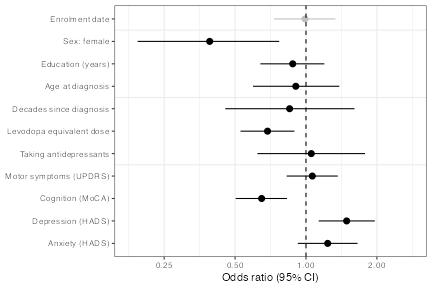
</a>

**Figure**: Odds ratios for the main cross-sectional logistic regression,
showing the associations between a set of key variables and apathy.

---------

<a href="Figures/individual-tests_proportions_npi-1.pdf">
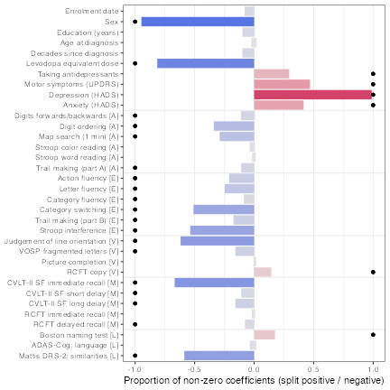
</a>
<a href="Figures/individual-tests_coefs_npi-1.pdf">
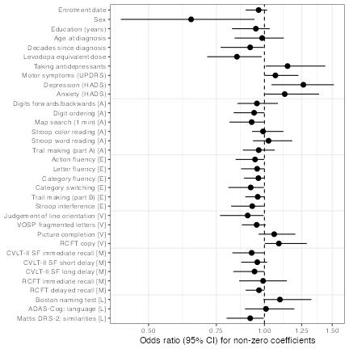
</a>

**Figure**: Regularised regressions looking for the associations between
individual cognitive tests and apathy presence. The proportion of times the
variable had a non-zero coefficient across repeats is shown on the left
(significance shown with dots), and the odds ratios are shown on the right.

---------

### Predictive models

The following use a multi-state Markov model to explore which covariates
predict whether or not a particular patient will develop apathy in the future.
One shortcoming of the cross-sectional model is that it does not account for
the fact that there are patients who may well have been at a high-risk of
developing apathy but died before those symptoms developed. The models
presented here account for the competing risks of apathy and mortality.

At this threshold, the key predictors for developing apathy in the future are
again lower medication, reduced cognitive function, and depression. However, as
the survival plot and bar plot show, there is a significant increase in the
risk of dying associated with having apathy, even after controlling for all
other variables.

Finally, we plot some illustrative trajectories which capture what the model
predicts about apathy over the disease course. For example, in the plot of
trajectories that vary as a function of cognition, we see that patients with
reduced cognition very quickly develop apathy but then also die at a faster
rate. As such, even though the prevalence is relatively stable over time, the
make up of the cohort at different times is very different: early on, patients
with apathy are likely to have reduced cognition; whereas later on the opposite
will be true, and apathy will appear to affect those without cognitive deficits
simply because they have survived for longer.

---------

<a href="Figures/survival_ever-apathetic_npi-1.pdf">
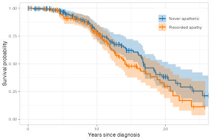
</a>
<a href="Figures/predictive-analyses_baseline-hazard_npi-1.pdf">
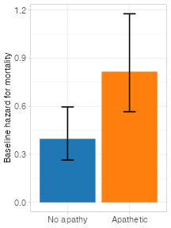
</a>

<a href="Figures/predictive-analyses_coefs-1-2_npi-1.pdf">
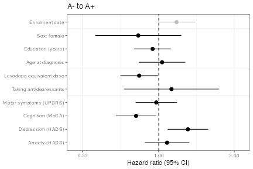
</a>

<a href="Figures/predictive-analyses_coefs-1-3_npi-1.pdf">
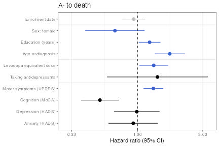
</a>
<a href="Figures/predictive-analyses_coefs-2-3_npi-1.pdf">
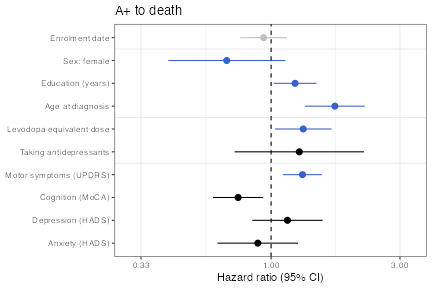
</a>

**Figure**: Multi-state model coefficients, as well as an illustrative survival
plot. The top row demonstrates that apathy was associated with higher mortality
after controlling for all other variables. The next two rows show the which
variables predict the onset of apathy, and then which variables are associated
with higher mortality. For the prediction of mortality, some coefficients were
constrained to have the same values irrespective of the presence or absence of
apathy to reduce the number of parameters of the model, and these are plotted
in blue.

---------

<a href="Figures/predictive-analyses_trajectories-MoCA_npi-1.pdf">
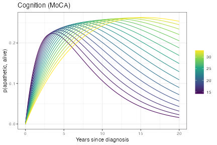
</a>
<a href="Figures/predictive-analyses_trajectories-HADS_depression_npi-1.pdf">
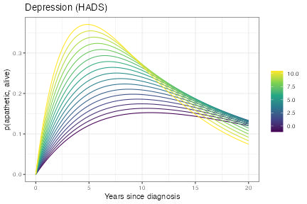
</a>

<a href="Figures/predictive-analyses_trajectories-transformed-dose_npi-1.pdf">
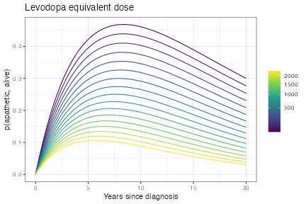
</a>
<a href="Figures/predictive-analyses_trajectories-UPDRS_motor_score_npi-1.pdf">
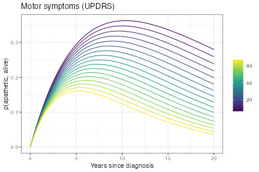
</a>

**Figure**: Predictions from the multi-state model, exploring how the
probability that a patient will still be alive, but will have developed apathy,
as both a function of time since diagnosis and some of the key covariates.

---------
