# Data Overview

This contains some exploratory visualisations of the raw data: predominantly
simple overviews of demographics and some quality control measures.

All images are clickable links to the higher-quality PDFs.

### Definitions

 + *Session / assessment:* The exclusion criteria are such that we only
   consider sessions where a neuropsychiatric assessment is performed. However,
   subjects may have many more sessions than assessments. Typically, we simply
   use the term session, though there are a couple of places where the
   distinction is important (e.g. session numbering: a patient's 5th session
   may only be their 3rd assessment).

 + *Baseline:* We use this term fairly loosely here, as there are no major
   differences in data collection between the first and subsequent assessments
   (and many subject's first visits are in fact screening sessions). As such,
   we take the first full assessment that happened within 90 days of the first
   visit as a 'baseline', though this is purely for illustrative purposes.

### Data collection

The following figures show some summaries of key metrics pertaining to data
collection: number of sessions, times between sessions, etc.

---------

<a href="Figures/session-type_v_year.pdf">
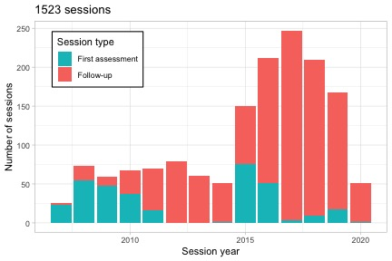
</a>
<a href="Figures/session-type_v_years-enrolled.pdf">
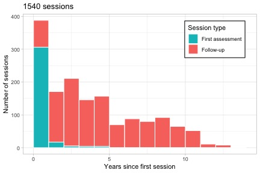
</a>
 

<a href="Figures/session-number.pdf">
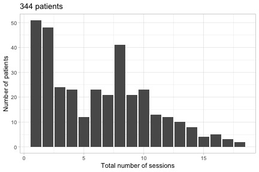
</a>
<a href="Figures/assessment-number.pdf">
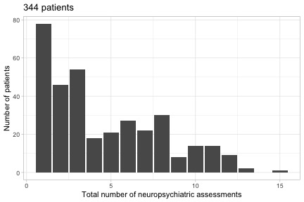
</a>

**Figure**: Summaries of the key variables relating to data collection.

### Key correlations

The following figures show the raw correlations between several of the key
variables of interest. Note that these are for visualisation only: they do not
take into account e.g. subject structure.

---------

<a href="Figures/correlations_key-variables.pdf">
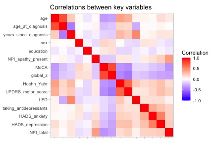
</a>

<a href="Figures/correlations_NPI-tests.pdf">
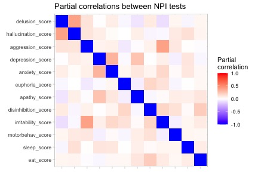
</a>

**Figure**: Summaries of the correlations between key variables.

---------

### Demographic information

The following figures show some simple, cross-sectional summaries of the
patient- and session-level data included in the main analyses.

--------

<a href="Figures/age+sex_at_baseline.pdf">
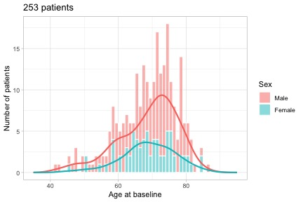
</a>
<a href="Figures/age+sex_at_session.pdf">
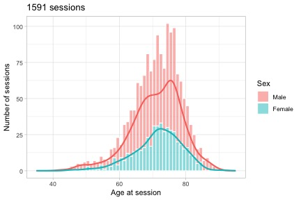
</a>
 

<a href="Figures/age_at_baseline.pdf">
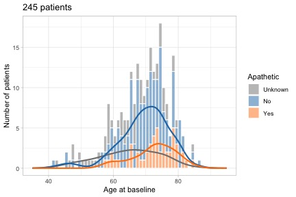
</a>
<a href="Figures/age_at_session.pdf">
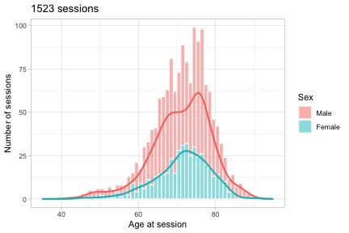
</a>
 

<a href="Figures/years-since-diagnosis_at_baseline.pdf">
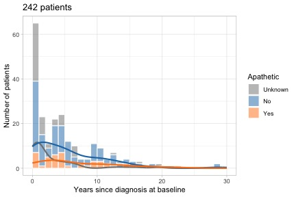
</a>
<a href="Figures/years-since-diagnosis_at_session.pdf">
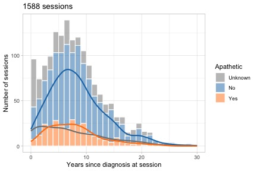
</a>
 

<a href="Figures/age-at-diagnosis_at_baseline.pdf">
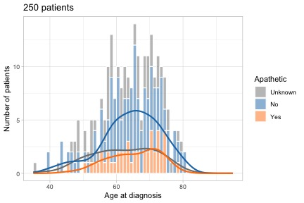
</a>
<a href="Figures/age-at-diagnosis_at_session.pdf">
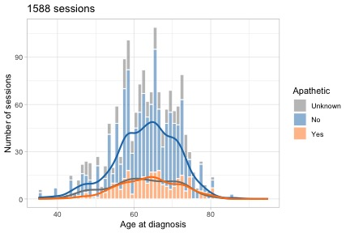
</a>
 

<a href="Figures/motor-scores_at_baseline.pdf">
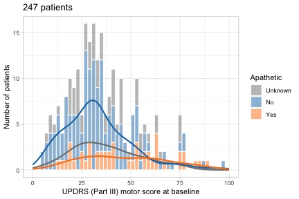
</a>
<a href="Figures/motor-scores_at_session.pdf">
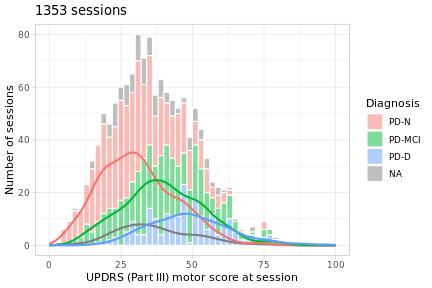
</a>
 

<a href="Figures/cognitive-scores_at_baseline.pdf">
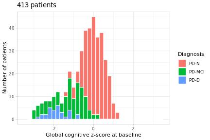
</a>
<a href="Figures/cognitive-scores_at_session.pdf">
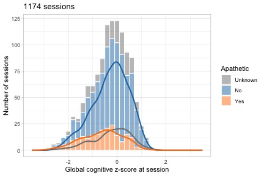
</a>
 

<a href="Figures/MoCA_at_baseline.pdf">
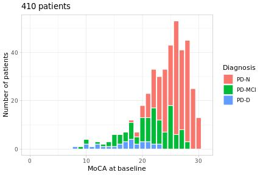
</a>
<a href="Figures/MoCA_at_session.pdf">
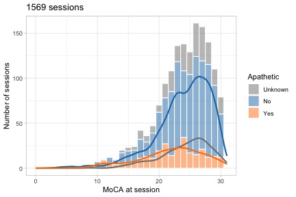
</a>
 

<a href="Figures/HADS-anxiety_at_baseline.pdf">
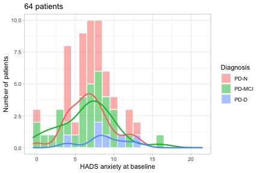
</a>

 

<a href="Figures/HADS-depression_at_baseline.pdf">
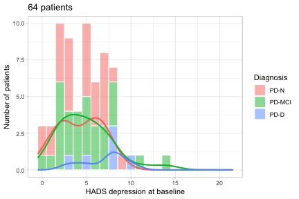
</a>
<a href="Figures/HADS-depression_at_session.pdf">
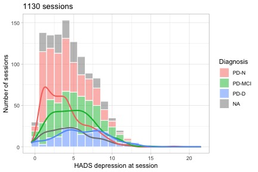
</a>
 

<a href="Figures/medication_at_baseline.pdf">
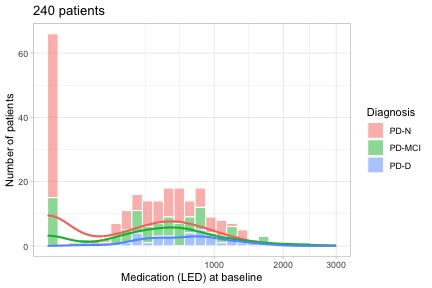
</a>
<a href="Figures/medication_at_session.pdf">
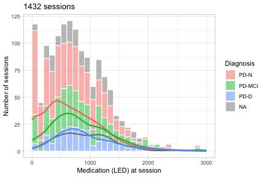
</a>

**Figure**: Cross-sectional summaries of key patient-specific variables, both
at baseline and pooled across all sessions.

---------

### Demographic information (longitudinal)

The following figures show how some key metrics change over time within
subject. Note how, for the continuous variables, the dynamics of progression
within-subject are not completely captured by the cross-sectional summary
(black line).

---------

<a href="Figures/apathy_v_years-enrolled_matchstick.pdf">
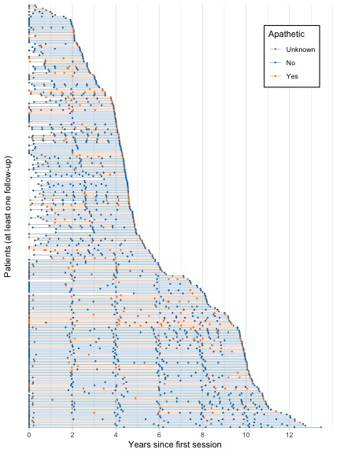
</a>
<a href="Figures/apathy_v_session-date_matchstick.pdf">
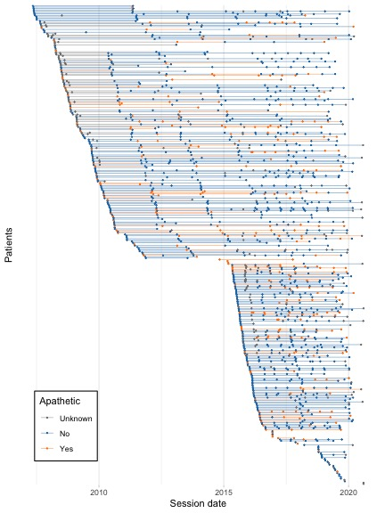
</a>
 

<a href="Figures/apathy_v_years-since-first-session_alluvial.pdf">
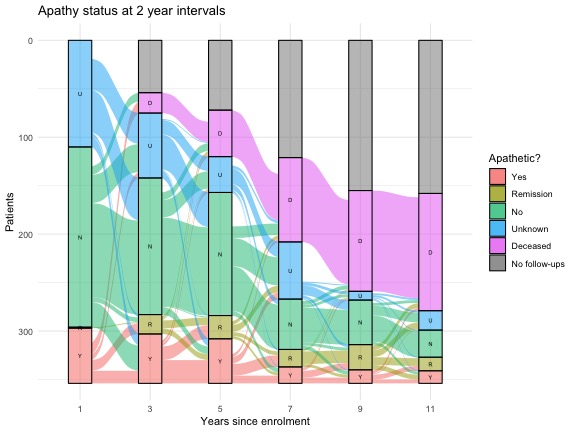
</a>
<a href="Figures/apathy_v_years-since-first-session_bar.pdf">
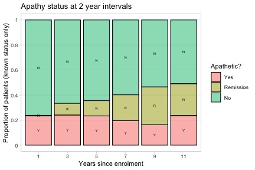
</a>
 

<a href="Figures/apathy_v_years-since-diagnosis_bar.pdf">
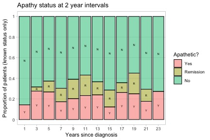
</a>
 

<a href="Figures/motor-scores_v_age.pdf">
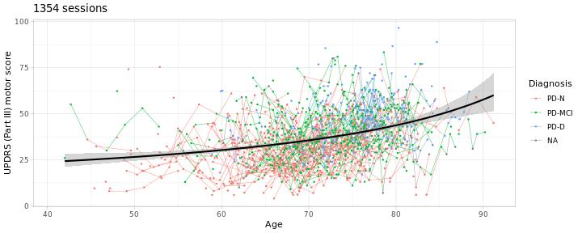
</a>
 

<a href="Figures/cognitive-scores_v_age.pdf">
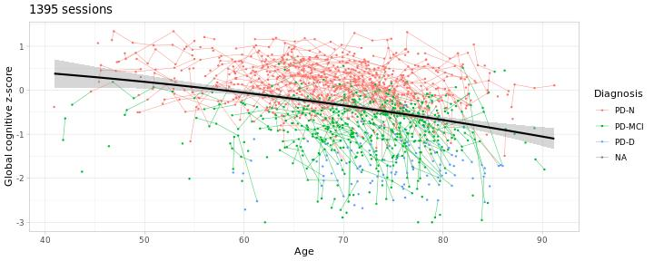
</a>
 

<a href="Figures/medication_v_years-since-diagnosis.pdf">
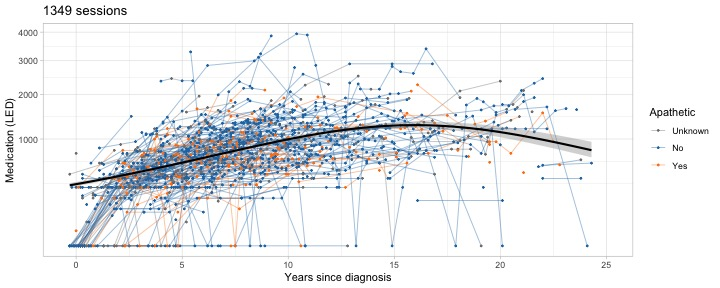
</a>
 

<a href="Figures/medication_v_years-before-death.pdf">
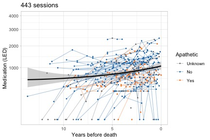
</a>

**Figure**: Longitudinal changes in key subject-specific variables.

---------

### Changes over time in recruitment

The following figures show how some key metrics change as a function of
recruitment date.

---------

<a href="Figures/age-at-diagnosis_v_baseline-date.pdf">
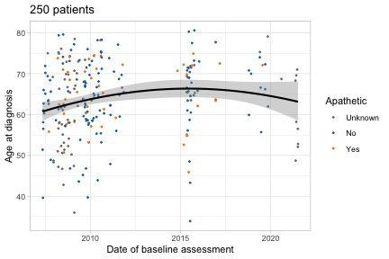
</a>
<a href="Figures/age_v_baseline-date.pdf">
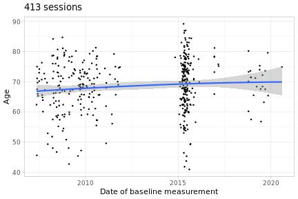
</a>
 

<a href="Figures/years-between-symptoms-and-diagnosis_v_baseline-date.pdf">
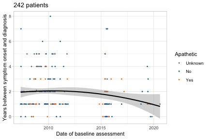
</a>
<a href="Figures/years-since-diagnosis_v_baseline-date.pdf">
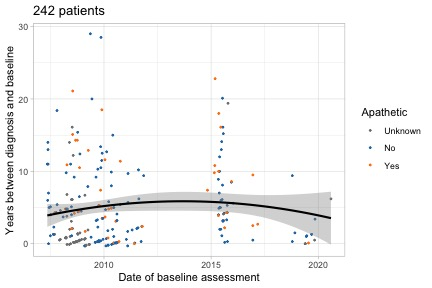
</a>
 

<a href="Figures/motor-scores_v_baseline-date.pdf">
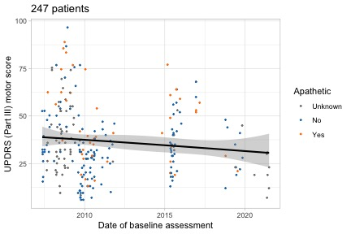
</a>
<a href="Figures/cognitive-scores_v_baseline-date.pdf">
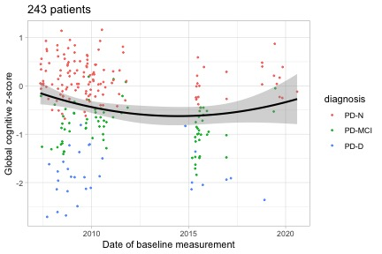
</a>
 

**Figure**: Changes in key subject-specific variables as a function of
recruitment date.

---------

### Consistency of collection of apathy measures

The figure below shows several effects:

 + In general, there is more missing data from the UPDRS than the NPI. This
   because only Part III of the UPDRS is collected in short assessments, and
   this does not contain the apathy measure.

 + The missing UPDRS data from 2010 and before relates to the change in
   protocol: the updated MDS-UPDRS contains questions specific to apathy, but
   the 1987 version in use originally does not.

--------

<a href="Figures/npi-presence_v_year.pdf">
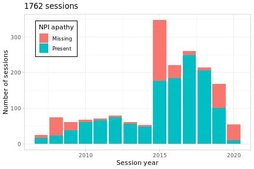
</a>
<a href="Figures/npi-presence_v_assessment-number.pdf">
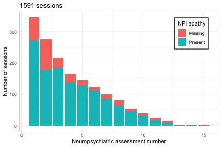
</a>
 

<a href="Figures/updrs-presence_v_year.pdf">
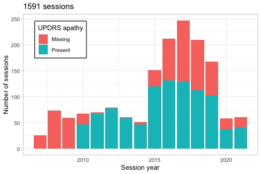
</a>
<a href="Figures/updrs-presence_v_assessment-number.pdf">
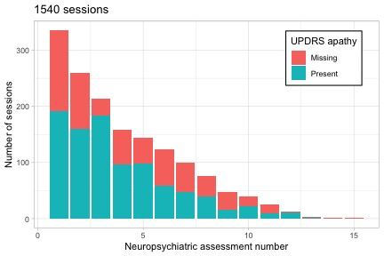
</a>

**Figure**: Breakdown of the sessions with available apathy measures by both
year and the session number.

---------

### Consistency of different apathy measures

The figure below shows the relationship between the measures of apathy from the
MDS-UPDRS and NPI.

--------

<a href="Figures/apathy_UPDRS-v-NPI_stack.pdf">
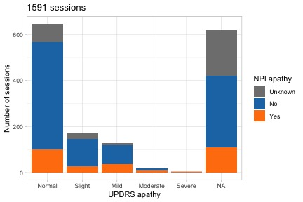
</a>
<a href="Figures/apathy_UPDRS-v-NPI_fill.pdf">
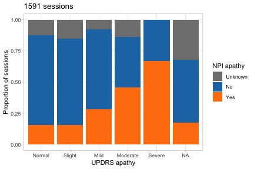
</a>

**Figure**: Cross-tabulation of NPI and MDS-UPDRS apathy measures. For the NPI,
we take the simple Yes/No response for the apathy subsection, and for the
MDS-UPDRS we take the responses to Q1.5.

---------
