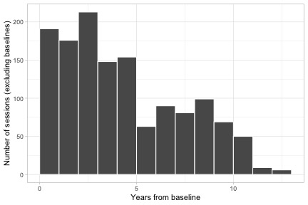
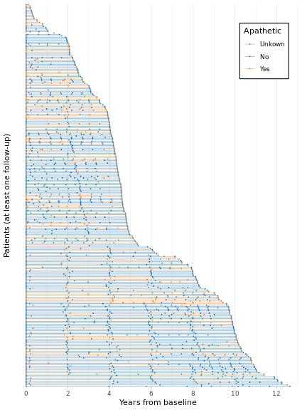
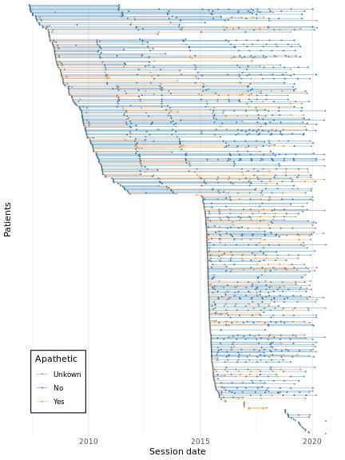
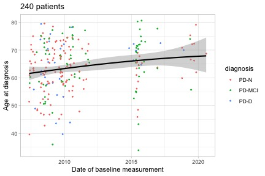
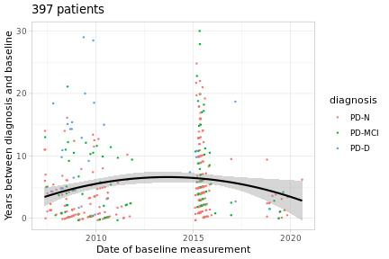
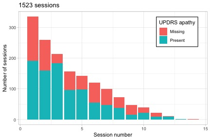

# Data Overview

This contains some exploratory visualisations of the raw data: predominantly
simple overviews of demographics and some quality control measures.

All images are clickable links to the higher-quality PDFs.

### Data collection

The following figures show some summaries of key metrics pertaining to data
collection: number of sessions, times from baseline, etc.

---------

 

**Figure**: Summaries of the key variables relating to data collection.

---------

### Demographic information

The following figures show some simple, cross-sectional summaries of the
patient- and session-level data included in the main analyses.

--------

 

 

 

 

**Figure**: Cross-sectional summaries of key patient-specific variables, both
at baseline and pooled across all sessions.

---------

### Demographic information (longitudinal)

The following figures show how some key metrics change over time within
subject. Note how, for the continuous variables, the dynamics of progression
within-subject are not completely captured by the cross-sectional summary
(black line).

---------

 

 

**Figure**: Longitudinal changes in key subject-specific variables.

---------

### Changes over time in recruitment

The following figures show how some key metrics change as a function of
recruitment date.

---------

 

 

 

**Figure**: Changes in key subject-specific variables as a function of
recruitment date.

---------

### Consistency of collection of apathy measures

The figure below shows several effects:

 + There a large number of missing sessions in 2015. This was due to different
   data collection procedures at the start of the PET study, and as these were
   mostly new participants this is also responsible for the large spike in
   missing assessments in baseline sessions (discussed with Kyla Horne,
   28/10/2020).

 + The missing UPDRS data from 2010 and before relates to the change in
   protocol: the updated MDS-UPDRS contains questions specific to apathy, but
   the 1987 version in use originally does not.

--------

 

**Figure**: Breakdown of the sessions with available apathy measures by both
year and the session number.

---------

### Consistency of different apathy measures

The figure below shows the relationship between the measures of apathy from the
MDS-UPDRS and NPI.

--------

**Figure**: Cross-tabulation of NPI and MDS-UPDRS apathy measures. For the NPI,
we take the simple Yes/No response for the apathy subsection, and for the
MDS-UPDRS we take the responses to Q1.5.

---------
