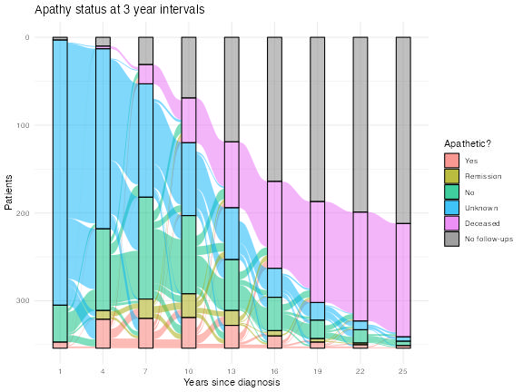
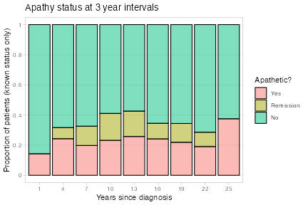

# Apathy in Parkinson's

This repository contains the key code attached with the CMRF-funded
[*Predictors of apathy in Parkinson's disease*](https://cmrf.org.nz/research/predictors-of-apathy-in-parkinsons-disease/)
project.

The key findings have been published in Neurology: Le Heron et al.,
*Cross-Sectional and Longitudinal Association of Clinical and Neurocognitive
Factors With Apathy in Patients With Parkinson's Disease*, Neurology 102 (12),
2024.
[DOI: 10.1212/WNL.0000000000209301](https://doi.org/10.1212/WNL.0000000000209301).
Note that the summary documents in this repository define apathy as an NPI
apathy score greater than or equal to 1, whereas the paper uses a higher
threshold of 4. The results and figures at that threshold are also included in
the various output folders here.

Anonymised data is available on request for those wishing to reproduce the
various analyses. The general properties of the data itself are detailed
visually in [the data overview document](DataOverview.md) and tabulated in
[the tables folder](Tables/).

More detailed notes and some of the core hypotheses are detailed in
[the analysis plan](AnalysisPlan.md), and the analyses themselves can be found
in [the analysis overview document](AnalysisOverview.md).

The overall project also included imaging analyses, but these are maintained
separately. The main publication for those analyses is Morris et al., *Altered
nucleus accumbens functional connectivity precedes apathy in Parkinson's
disease*, Brain 146, 2023.
[DOI: 10.1093/brain/awad113](https://doi.org/10.1093/brain/awad113).

### Running the Code

To reproduce the analyses from the manuscript, use:
```shell
cd pd-apathy/Code/
NPI_APATHY_THRESHOLD=4 Rscript exploratory_visualisations.R
NPI_APATHY_THRESHOLD=4 Rscript summary_tables.R
NPI_APATHY_THRESHOLD=4 Rscript cross_sectional_analyses.R
NPI_APATHY_THRESHOLD=4 Rscript individual_test_predictions.R
NPI_APATHY_THRESHOLD=4 Rscript predictive_analyses.R
```

The files can also be run interactively using Rstudio, e.g.
```R
setwd("pd-apathy/Code/")
source("predictive_analyses.R", echo = TRUE)
```

### Contacts

 + [Sam Harrison](https://www.nzbri.org/People/harrison/)
 + [Campbell Le Heron](https://www.nzbri.org/People/le-heron/)
 + [Kyla-Louise Horne](https://www.nzbri.org/People/horne/)

---------

<a href="Figures/apathy_v_years-since-diagnosis_alluvial_npi-1.pdf">

</a>
<a href="Figures/apathy_v_years-since-diagnosis_bar_npi-1.pdf">

</a>

**Figure**: Evolution of apathy as a function of years since diagnosis with
Parkinson's disease within this cohort.
